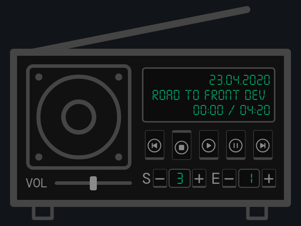

<p align="center">
  
</p>

# Zalana Radio - Player

Web audio player inspired by classic 80s radio design. The project enables podcast and radio show playback with an intuitive interface reminiscent of vintage electronic devices.

**Note:** The user interface is in Polish language.

## 🚀 Features

- **🎛️ Full playback control** - Play, Pause, Stop, forward and backward seeking
- **🔊 Volume regulation** - Smooth audio level control
- **📻 Season and episode selection** - Intuitive regulators for navigation
- **📱 Responsive Design** - Adapts to different screen sizes
- **🎨 Retro UI** - Stylized interface with 3D effects and animations
- **⚡ Fast loading** - Performance optimization thanks to Preact
- **🌐 API Integration** - Dynamic content loading from external source

## 🛠️ Technologies Used

- **[Preact](https://preactjs.com/)** - Lightweight React alternative (3kB)
- **[TypeScript](https://www.typescriptlang.org/)** - Static typing
- **[CSS Modules](https://github.com/css-modules/css-modules)** - Style modularization
- **[Vite](https://vitejs.dev/)** - Modern bundler and dev server


## 🚀 Installation and Setup

### Requirements
- Node.js (≥18.0.0)
- npm or yarn

### Installation Steps

1. **Clone the repository**
   ```bash
   git clone <repository-url>
   cd zalana-radio
   ```

2. **Install dependencies**
   ```bash
   npm install
   ```

3. **Configure API**
   ```bash
   # Copy and edit environment variables
   echo "VITE_API_URL=your_api_endpoint" > .env.local
   ```

4. **Run development server**
   ```bash
   npm run dev
   ```

5. **Build for production**
   ```bash
   npm run build
   ```

## ⚙️ Configuration

The application uses environment variables:

- `VITE_API_URL` - API endpoint providing episode data

API data format:
```typescript
type Episode = {
  date: string;    // ISO date string
  name: string;    // Episode title
  url: string;     // Audio file URL
};

type Season = Episode[];
type Data = Season[];
```
